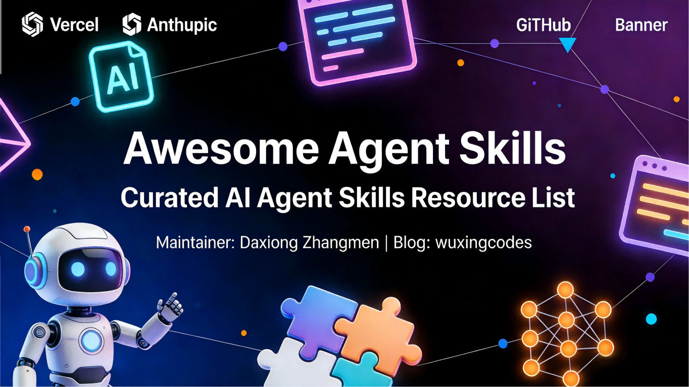

<div align="center">

# Awesome Agent Skills


<p align="center">
  
</p>

A curated list of Agent Skills resources, including official team repositories, community independent skills, aggregation projects, supporting tools, and learning tutorials.

> 💡 **Why Care About Agent Skills?** Skills are becoming the new standard for AI agents—empowering Claude, Codex, Gemini, and more with modular knowledge packages for specialized capabilities. One agent. Unlimited specializations.

<p align="center">
  <a href="https://awesome.re">
    
  </a>
  <a href="http://creativecommons.org/publicdomain/zero/1.0/">
    
  </a>
</p>

<p align="center">
  <a href="https://blog.wuxingcodes.com">
    
  </a>
</p>

<p align="center">
  <a href="README.md">English</a> | <a href="README.zh-CN.md">中文</a>
</p>
</div>

---

## Quick Start

### What Are Agent Skills?

**Agent Skills** is an open standard driven by Anthropic that packages professional knowledge into reusable skill modules, enabling AI agents to load specific capabilities on demand.

**Core Benefits:**
- 🧠 **Progressive Loading** - Load only relevant skills when needed, saving context
- 🔧 **Cross-Platform** - Same skill works across Claude, Codex, Copilot, etc.
- 📦 **Modular Design** - Write once, use everywhere
- 🚀 **Zero-Cost Distribution** - Share and version control through Git repositories

### Supported Platforms

| Platform | Project Path | Global Path | Docs |
|----------|-------------|-------------|------|
| **Claude Code** | `.claude/skills/` | `~/.claude/skills/` | [Docs](https://code.claude.com/docs/en/skills) |
| **GitHub Copilot** | `.github/skills/` | `~/.copilot/skills/` | [Docs](https://docs.github.com/en/copilot/concepts/agents/about-agent-skills) |
| **Cursor** | `.cursor/skills/` | `~/.cursor/skills/` | [Docs](https://cursor.com/docs/context/skills) |
| **OpenCode** | `.opencode/skills/` | `~/.config/opencode/skills/` | [Docs](https://opencode.ai/docs/skills) |
| **Windsurf** | `.windsurf/skills/` | `~/.codeium/windsurf/skills/` | [Docs](https://docs.windsurf.com/windsurf/cascade/skills) |

---

## Table of Contents

- [Official Team Repositories](#official-team-repositories) - Official skill collections from Anthropic, Vercel Labs, OpenAI, etc.
- [Community Independent Skills](#community-independent-skills) - High-quality independent skill repositories by category
- [Supporting Tools](#supporting-tools) - Skill management, installation, and development tools
- [Learning Resources](#learning-resources) - Tutorials, guides, and best practices

---

## Official Team Repositories

### Anthropic Official Skills

| Skill | Description | Link |
|-------|-------------|------|
| **docx** | Create, edit, and analyze Word documents with tracked changes, comments, and formatting | [View →](https://github.com/anthropics/skills/tree/main/skills/docx) |
| **pdf** | Extract text and tables, create new PDFs, merge/split documents, process forms | [View →](https://github.com/anthropics/skills/tree/main/skills/pdf) |
| **pptx** | Create, edit, and analyze PowerPoint presentations with layouts and templates | [View →](https://github.com/anthropics/skills/tree/main/skills/pptx) |
| **xlsx** | Create, edit, and analyze Excel spreadsheets with formulas and charts | [View →](https://github.com/anthropics/skills/tree/main/skills/xlsx) |
| **algorithmic-art** | Create algorithmic and generative art using p5.js | [View →](https://github.com/anthropics/skills/tree/main/skills/algorithmic-art) |
| **mcp-builder** | Create high-quality MCP servers for integrating external APIs and services | [View →](https://github.com/anthropics/skills/tree/main/skills/mcp-builder) |
| **webapp-testing** | Test local web applications using Playwright for frontend functionality | [View →](https://github.com/anthropics/skills/tree/main/skills/webapp-testing) |
| **skill-creator** | Guidelines and best practices for creating effective Agent Skills | [View →](https://github.com/anthropics/skills/tree/main/skills/skill-creator) |

**Repository**: [anthropics/skills](https://github.com/anthropics/skills) | **Skills Count**: 16+

---

### Vercel Labs Skills

| Skill | Description | Link |
|-------|-------------|------|
| **react-best-practices** | React and Next.js best practices for modern web development | [View →](https://github.com/vercel-labs/agent-skills/tree/main/skills/react-best-practices) |
| **web-design-guidelines** | Web design guidelines and UI/UX best practices | [View →](https://github.com/vercel-labs/agent-skills/tree/main/skills/web-design-guidelines) |
| **vercel-deploy-claimable** | Vercel deployment and project management skills | [View →](https://github.com/vercel-labs/agent-skills/tree/main/skills/claude.ai/vercel-deploy-claimable) |

**Repository**: [vercel-labs/agent-skills](https://github.com/vercel-labs/agent-skills) | **Skills Count**: 3

---

### Other Official Team Repositories

| Organization | Repository | Skills Count | Description |
|--------------|-----------|--------------|-------------|
| **OpenAI** | [openai/skills](https://github.com/openai/skills) | ? | OpenAI Codex official skill collection |
| **Hugging Face** | [huggingface/skills](https://github.com/huggingface/skills) | ? | Using Skills to train LLMs on HuggingFace |

---

## Community Independent Skills

### 📄 Document Processing

| Repository | Description | Author |
|------------|-------------|--------|
| [claude-epub-skill](https://github.com/smerchek/claude-epub-skill) | Convert markdown documents to professional EPUB ebooks | [@smerchek](https://github.com/smerchek) |

---

### 💻 Development & Code Tools

| Repository | Description | Author |
|------------|-------------|--------|
| [aws-skills](https://github.com/zxkane/aws-skills) | AWS development with CDK best practices, cost optimization, and serverless architecture | [@zxkane](https://github.com/zxkane) |
| [claude-d3js-skill](https://github.com/chrisvoncsefalvay/claude-d3js-skill) | Teach Claude to generate D3 charts and interactive data visualizations | [@chrisvoncsefalvay](https://github.com/chrisvoncsefalvay) |
| [playwright-skill](https://github.com/lackeyjb/playwright-skill) | Playwright browser automation for testing and validating web applications | [@lackeyjb](https://github.com/lackeyjb) |
| [ios-simulator-skill](https://github.com/conorluddy/ios-simulator-skill) | Interact with iOS Simulator for testing and debugging iOS applications | [@conorluddy](https://github.com/conorluddy) |
| [claude-code-terminal-title](https://github.com/bluzername/claude-code-terminal-title) | Give each Claude Code terminal window a dynamic title describing the work being done | [@bluzername](https://github.com/bluzername) |
| [move-code-quality-skill](https://github.com/1NickPappas/move-code-quality-skill) | Analyze Move language packages for code quality compliance | [@1NickPappas](https://github.com/1NickPappas) |
| [ffuf_claude_skill](https://github.com/jthack/ffuf_claude_skill) | Integrate ffuf web fuzzer for vulnerability analysis | [@jthack](https://github.com/jthack) |
| [ui-skills](https://github.com/ibelick/ui-skills) | Interface building guidelines and best practices | [@ibelick](https://github.com/ibelick) |
| [pypict-claude-skill](https://github.com/omkamal/pypict-claude-skill) | Design comprehensive test cases using PICT pairwise combinatorial testing | [@omkamal](https://github.com/omkamal) |
| [claude-bootstrap](https://github.com/alinaqi/claude-bootstrap) | Security-first project initialization and development environment setup | [@alinaqi](https://github.com/alinaqi) |
| [the-unofficial-swift-concurrency-migration-skill](https://github.com/kylehughes/the-unofficial-swift-concurrency-migration-skill) | Swift concurrency migration guide | [@kylehughes](https://github.com/kylehughes) |
| [obsidian-plugin-skill](https://github.com/gapmiss/obsidian-plugin-skill) | Obsidian plugin development | [@gapmiss](https://github.com/gapmiss) |

---

### 📊 Data & Analysis

| Repository | Description | Author |
|------------|-------------|--------|
| [csv-data-summarizer-claude-skill](https://github.com/coffeefuelbump/csv-data-summarizer-claude-skill) | Automatically analyze CSV files and generate visualized insights without user prompts | [@coffeefuelbump](https://github.com/coffeefuelbump) |
| [ai-skills](https://github.com/sanjay3290/ai-skills) | PostgreSQL queries, deep research, and Google Imagen integration | [@sanjay3290](https://github.com/sanjay3290) |

---

### 🔄 Collaboration & Project Management

| Repository | Description | Author |
|------------|-------------|--------|
| [claude-skills-marketplace](https://github.com/mhattingpete/claude-skills-marketplace) | Git operations automation, code implementation evaluation, test failure fixes | [@mhattingpete](https://github.com/mhattingpete) |
| [superpowers-lab](https://github.com/obra/superpowers-lab) | TDD, Git worktree, finishing development branches, debugging, root cause tracing, brainstorming, subagent-driven development | [@obra](https://github.com/obra) |
| [linear-claude-skill](https://github.com/wrsmith108/linear-claude-skill) | Linear issue management integration | [@wrsmith108](https://github.com/wrsmith108) |
| [x-article-publisher-skill](https://github.com/wshuyi/x-article-publisher-skill) | Publish articles to X/Twitter | [@wshuyi](https://github.com/wshuyi) |
| [notebooklm-skill](https://github.com/PleasePrompto/notebooklm-skill) | Use NotebookLM for document-based conversations | [@PleasePrompto](https://github.com/PleasePrompto) |

---

### 🧪 Testing & Development

| Repository | Description | Author |
|------------|-------------|--------|
| [vexor](https://github.com/scarletkc/vexor) | Vector-driven CLI semantic file search | [@scarletkc](https://github.com/scarletkc) |
| [dev-agent-skills](https://github.com/fvadicamo/dev-agent-skills) | Git/GitHub workflows, Conventional Commits, and PR management | [@fvadicamo](https://github.com/fvadicamo) |
| [react-native-best-practices](https://github.com/callstackincubator/agent-skills) | React Native best practices | [@callstackincubator](https://github.com/callstackincubator) |
| [makepad-skills](https://github.com/ZhangHanDong/makepad-skills) | Makepad UI development (Rust applications) | [@ZhangHanDong](https://github.com/ZhangHanDong) |

---

### 🔧 Context Engineering

| Repository | Description | Author |
|------------|-------------|--------|
| [Agent-Skills-for-Context-Engineering](https://github.com/muratcankoylan/Agent-Skills-for-Context-Engineering) | Context engineering skill collection (8 skills) for building production-grade AI systems | [@muratcankoylan](https://github.com/muratcankoylan) |
| [context-engineering-kit](https://github.com/NeoLabHQ/context-engineering-kit) | Prompt engineering, software architecture, SADD (subagent-driven development), Kaizen (continuous improvement) | [@NeoLabHQ](https://github.com/NeoLabHQ) |

---

### 🧬 Specialized Domains

| Repository | Description | Author |
|------------|-------------|--------|
| [claude-scientific-skills](https://github.com/K-Dense-AI/claude-scientific-skills) | Skill collection for scientific researchers (128+ scientific skills) | [@K-Dense-AI](https://github.com/K-Dense-AI) |
| [clarity-gate](https://github.com/frmoretto/clarity-gate) | Pre-ingestion validation for RAG systems | [@frmoretto](https://github.com/frmoretto) |
| [materials-simulation-skills](https://github.com/HeshamFS/materials-simulation-skills) | Computational materials science (numerical stability, time stepping, etc.) | [@HeshamFS](https://github.com/HeshamFS) |
| [varlock-claude-skill](https://github.com/wrsmith108/varlock-claude-skill) | Varlock project management | [@wrsmith108](https://github.com/wrsmith108) |

---

### 🔒 Security & Systems

| Repository | Description | Author |
|------------|-------------|--------|
| [cloudflare-skill](https://github.com/dmmulroy/cloudflare-skill) | Cloudflare security integration | [@dmmulroy](https://github.com/dmmulroy) |

---

### ✍️ Writing & Content

| Repository | Description | Author |
|------------|-------------|--------|
| [claude-family-history-research-skill](https://github.com/emaynard/claude-family-history-research-skill) | Family history research | [@emaynard](https://github.com/emaynard) |
| [tapestry-skills-for-claude-code](https://github.com/michalparkola/tapestry-skills-for-claude-code) | Tapestry writing skills (article extraction, YouTube transcripts, Ship Learn Next, knowledge networks) | [@michalparkola](https://github.com/michalparkola) |
| [claude-code-tips](https://github.com/ykdojo/claude-code-tips) | Claude Code usage tips (includes Reddit fetch) | [@ykdojo](https://github.com/ykdojo) |
| [notebooklm-py](https://github.com/teng-lin/notebooklm-py) | NotebookLM Python control | [@teng-lin](https://github.com/teng-lin) |
| [baoyu-skills](https://github.com/JimLiu/baoyu-skills) | Baoyu's personal skill collection | [@JimLiu](https://github.com/JimLiu) |
| [skill-prompt-generator](https://github.com/huangserva/skill-prompt-generator) | Skill prompt generator | [@huangserva](https://github.com/huangserva) |
| [NanoBanana-PPT-Skills](https://github.com/op7418/NanoBanana-PPT-Skills) | Generate PPT based on NanoBanana | [@op7418](https://github.com/op7418) |

---

### 🏢 Enterprise Workflows

| Repository | Description | Author |
|------------|-------------|--------|
| [dify](https://github.com/langgenius/dify) | Dify official skills collection | [@langgenius](https://github.com/langgenius) |
| [obsidian-skills](https://github.com/kepano/obsidian-skills) | Skills collection to enhance Obsidian functionality | [@kepano](https://github.com/kepano) |

---

### 🧑‍💻 Programming Assistance

| Repository | Description | Author |
|------------|-------------|--------|
| [ui-ux-pro-max-skill](https://github.com/nextlevelbuilder/ui-ux-pro-max-skill) | UI/UX design best practices | [@nextlevelbuilder](https://github.com/nextlevelbuilder) |
| [planning-with-files](https://github.com/OthmanAdi/planning-with-files) | Long-term planning using files | [@OthmanAdi](https://github.com/OthmanAdi) |

---

### 🧪 Development & Testing Tools

| Repository | Description | Author |
|------------|-------------|--------|
| [dev-browser](https://github.com/SawyerHood/dev-browser) | Developer browser tool | [@SawyerHood](https://github.com/SawyerHood) |
| [skillport](https://github.com/gotalab/skillport) | Skills port tool | [@gotalab](https://github.com/gotalab) |
| [sheets-cli](https://github.com/gmickel/sheets-cli) | Google Sheets CLI | [@gmickel](https://github.com/gmickel) |
| [SkillsBench](https://github.com/benchflow-ai/SkillsBench) | Skills benchmarking | [@benchflow-ai](https://github.com/benchflow-ai) |
| [pomodoro](https://github.com/jakedahn/pomodoro) | Pomodoro timer skill | [@jakedahn](https://github.com/jakedahn) |
| [Mind-Cloning-Engineering](https://github.com/yzfly/Mind-Cloning-Engineering) | Mind cloning engineering | [@yzfly](https://github.com/yzfly) |

---

### 🤖 Automation & Integration

| Repository | Description | Author |
|------------|-------------|--------|
| [n8n-skills](https://github.com/czlonkowski/n8n-skills) | n8n workflow automation skill collection (7 skills) | [@czlonkowski](https://github.com/czlonkowski) |
| [n8n-skills](https://github.com/haunchen/n8n-skills) | n8n workflow automation skill collection (alternative implementation) | [@haunchen](https://github.com/haunchen) |

---

### 🛠️ Supporting Tools

| Repository | Description | Type |
|------------|-------------|------|
| [openskills](https://github.com/numman-ali/openskills) | Skills global loader supporting Claude Code, Cursor, Windsurf, and other AI tools | CLI Tool |
| [Skill_Seekers](https://github.com/yusufkaraaslan/Skill_Seekers) | Automatically scrape documentation websites, GitHub repos, and PDFs to convert into Agent Skills | Automation Tool |
| [agentskills-mcp](https://github.com/zouyingcao/agentskills-mcp) | Bring Agent Skills to any MCP-compatible AI agent through MCP | MCP Server |
| [agent-skills-guard](https://github.com/brucevanfdm/agent-skills-guard) | Agent Skills visual management + curated repositories + security scanning | Management Tool |
| [skillmaster](https://github.com/davidyangcool/agent-skill) | Manage, install, and use Agent Skills through terminal | CLI Tool |
| [skild.sh](https://skild.sh) | Command-line tool to install, manage, and sync skills across multiple tools | Website |

---

## Learning Resources

### Official Documentation

- [Agent Skills Specification](https://agentskills.io) - Open format specification and documentation
- [What Are Skills](https://agentskills.io/what-are-skills) - Skill concept explanation
- [Specification](https://agentskills.io/specification) - Format specification details
- [Creating Skills](https://support.claude.com/en/articles/12512198-creating-custom-skills) - Skill creation guide

### Creation Guides

- [Skill Authoring Best Practices](https://platform.claude.com/docs/en/agents-and-tools/agent-skills/best-practices) - Official best practices
- [agent-skills-guide](https://github.com/zebbern/agent-skills-guide) - Community creation guide

### Engineering Deep Dives

- [Equipping agents for the real world](https://www.anthropic.com/engineering/equipping-agents-for-the-real-world-with-agent-skills) - Anthropic engineering blog
- [Skills explained: How Skills compares](https://claude.com/blog/skills-explained) - Skills comparison with other approaches
- [Extending Claude's capabilities](https://claude.com/blog/extending-claude-capabilities-with-skills-mcp-servers) - Skills and MCP integration

---

## Contributing

Pull Requests are welcome to add new Agent Skills repositories!

### Submission Guidelines

1. **Fork this repository** and create a feature branch
2. **Add skills** under appropriate categories, in alphabetical order
3. **Format requirements**:
   ```markdown
   | [Repo Name](https://github.com/username/repository) | Brief description | [@Author](https://github.com/username) |
   ```
4. **Quality standards**:
   - ✅ Independent repositories with `SKILL.md` files (minimum **5 stars**)
   - ✅ Official organization repositories (Anthropic, Vercel Labs, OpenAI, Dify, etc.)
   - ❌ No personal/community aggregation repositories (to avoid duplication)
   - ❌ No pure documentation/tutorial projects (put in learning resources)
   - ❌ No projects with fewer than 5 stars (quality control)

### Local Preview

```bash
# Clone repository
git clone https://github.com/MaesHughes/awesome-agent-skills.git
cd awesome-agent-skills

# Install dependencies
npm install -g markdown-link-check

# Check links
markdown-link-check README.md

# Preview Markdown
npx serve
```

---

## License

This project is licensed under [CC0 1.0 Universal](LICENSE). You are free to use, modify, and distribute the content of this list.

<div align="center">

---

**[⬆ Back to Top](#awesome-agent-skills)**

**Maintainer**: [大熊掌门](https://github.com/MaesHughes) | **Blog**: [五行代码](https://blog.wuxingcodes.com/)

**📝 [中文文档](README.zh-CN.md)**

</div>
